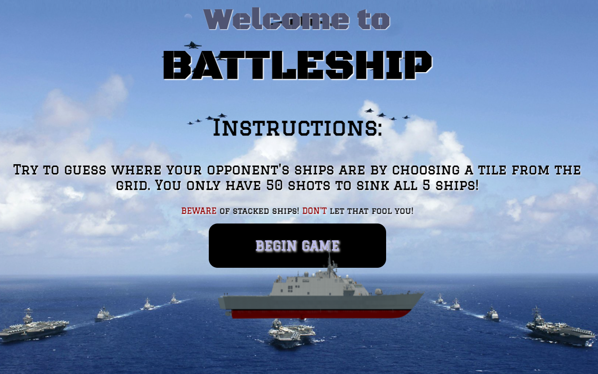
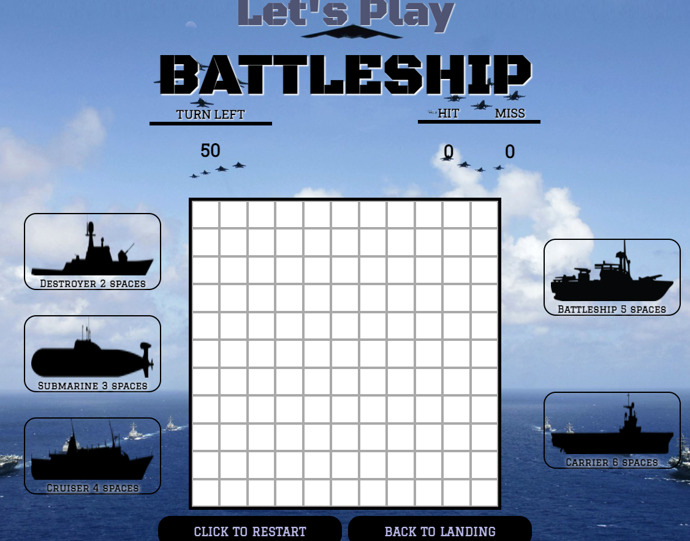
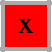

# 
**WELCOME TO BATTLESHIP**

## Date 03-06-21
## By: Ran Kim
****
### Description

#### Let's play Battleship! Engage in a single player game of battleship where you have 50 tries to find the placement of all 5 ships!
****
### How To Get Started
- Fork and Clone
- git add . / git commit -m " " &rarr; all changes you make
****
### Technologies Used
#  |  | | 
   
****
### How To Play

#### Hover $~$ over the grid and click on a cell. If it is a hit, the cell will turn . If it is a miss, the cell will turn . The image and text of the ships will disappear when you sink a ship! 
 

##### Click [here](rans-battleship.surge.sh) to play!

****
### Coming soon...

- sound effects
- scorboard of how many times you win
- 2 player option
****

### Links
[Trello](https://trello.com/invite/b/R6LhyJVK/13aae373d8fd00518ba836b830c37322/battleship)  | [Battleship](rans-battleship.surge.sh) | [Game Repository](https://github.com/rannkimm/BattleShip-Game)
****
